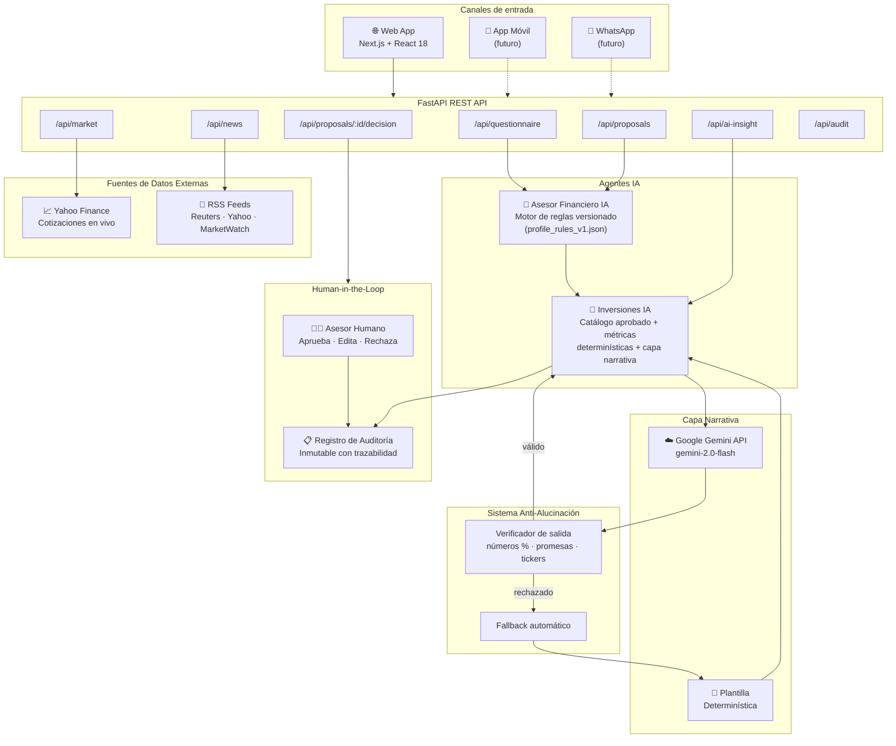
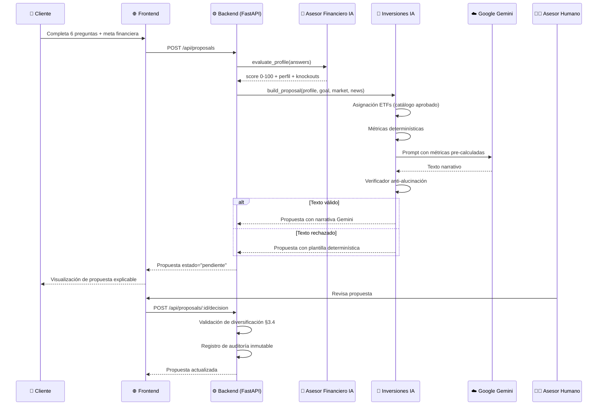
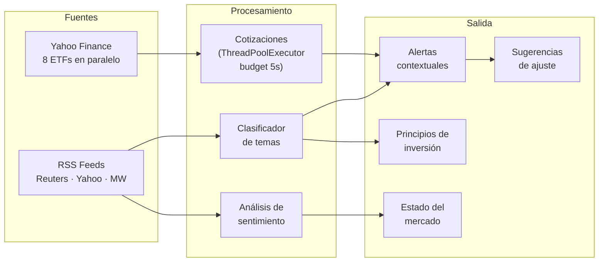
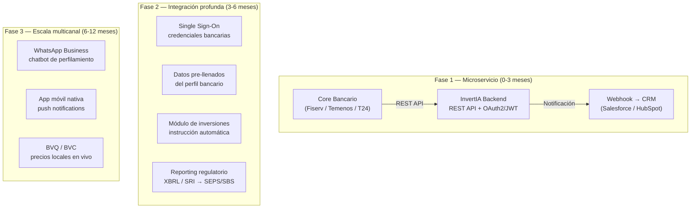

# InvertIA — Documento Explicativo Técnico

## Hackathon Agentic Scale · Ecuador Tech Week 2026 · Club TAWS · ESPOL

**Track asignado:** Track 3 — Robo-Advisory y Automatización  
**Equipo:** Club TAWS  
**Reto del patrocinador:** Best Use of Google Gemini

---

## 1. Diagrama de Arquitectura

### 1.1 Arquitectura general del sistema



### 1.2 Flujo de datos completo (secuencial)



### 1.3 Pipeline de análisis de mercado



---

## 2. Track Asignado

**Track 3 — Robo-Advisory financiero con IA**

InvertIA es un sistema de asesoramiento de inversiones con **dos agentes IA especializados**
y **supervisión humana obligatoria** (Human-in-the-Loop), diseñado para cumplir con los
principios de reguladores financieros internacionales:

| Principio regulatorio | Norma de referencia | Implementación en InvertIA |
|---|---|---|
| Suitability assessment documentado | FINRA Rule 2111, MiFID II Art. 25 | 6 preguntas con pesos, score 0-100, knockouts |
| Transparencia del cálculo | SEPS Ecuador, Reg BI | Fórmula pública, reglas versionadas, breakdown visible |
| Responsabilidad humana | MiFID II, normativa SEPS/SBS | Asesor humano aprueba/rechaza antes de entregar |
| Auditoría completa | FINRA, SOX, MiFID II | Registro inmutable: fecha + responsable + reglas |
| No ejecución automática | Principio prudencial | El sistema NO ejecuta órdenes ni promete rentabilidad |

---

## 3. Tipo de Negocio al que Aplica

### Aplicación primaria: Cooperativas de Ahorro y Crédito (COAC) — Ecuador

Ecuador tiene más de **500 cooperativas** reguladas por la SEPS. La mayoría carecen de:

- Herramientas digitales de perfilamiento de riesgo
- Procesos estructurados de suitability assessment
- Propuestas de inversión explicables para sus socios

**InvertIA resuelve exactamente este problema**: permite a una COAC ofrecer un proceso
de asesoramiento de inversión profesional sin necesitar un equipo de analistas dedicado,
manteniendo el asesor humano como responsable final (cumplimiento regulatorio SEPS/SBS).

### Aplicaciones secundarias

| Sector | Caso de uso |
|---|---|
| **Bancos privados** | Departamentos de banca privada para clientes de segmento medio |
| **Casas de valores** | Automatización del proceso de suitability antes de recomendar ETFs/fondos |
| **Fintech de ahorro** | Apps como Kushki, Pichincha Digital, Produbanco Digital |
| **Aseguradoras** | Perfilamiento de riesgo para productos de inversión vinculados a seguros |

---

## 4. Explicación Técnica y Workflow

### 4.1 Arquitectura "Deterministic Core + Narrative Layer"

El diseño se basa en una premisa fundamental: **el LLM solo redacta, nunca calcula**.

```
┌─────────────────────────────────────────────────────────────┐
│                    CAPA DETERMINÍSTICA                       │
│  Score = 100 × Σ(peso × (puntos - 1) / 3) / Σ(pesos)      │
│  Asignación = portafolio_modelo[perfil_id]                  │
│  Métricas = Σ(peso_i × retorno_i), Σ(peso_i × vol_i)       │
│  Goal Fit = (meta - invertido) / invertido / años × 100     │
│  Diversificación = ≥3 clases, ningún instrumento >50%       │
├─────────────────────────────────────────────────────────────┤
│                    CAPA NARRATIVA (Gemini)                   │
│  Input: métricas PRE-CALCULADAS inyectadas en el prompt     │
│  Output: texto narrativo en español claro                   │
│  Verificación: anti-alucinación → fallback si falla         │
└─────────────────────────────────────────────────────────────┘
```

### 4.2 Flujo de datos completo: del perfilamiento a la revisión del asesor

**Paso 1 — Perfilamiento del cliente**
1. El cliente responde 6 preguntas calibradas (objetivo, horizonte, reacción ante caídas, experiencia, estabilidad de ingresos, fondo de emergencia).
2. Cada pregunta tiene un peso (%) y puntos (1-4) públicos y versionados.
3. El **Agente Asesor Financiero IA** calcula el score (0-100) con la fórmula determinística.
4. Knockouts: reglas de protección que limitan el perfil máximo (ej. horizonte corto → máximo conservador).
5. El cliente puede definir una meta financiera personalizada (monto, plazo, aporte mensual).

**Paso 2 — Generación de la propuesta explicable**
1. El **Agente Inversiones IA** selecciona el portafolio modelo del catálogo aprobado (8 ETFs reales).
2. Calcula métricas agregadas: retorno esperado, volatilidad, nivel de riesgo, diversificación.
3. Calcula el goal_fit: brecha entre la meta del cliente y el rendimiento del portafolio.
4. Solicita a **Google Gemini** una explicación narrativa con las métricas pre-calculadas.
5. El verificador anti-alucinación valida la salida (números %, promesas, tickers fuera del catálogo).
6. Si el LLM falla o alucina → fallback a plantilla determinística (la demo nunca se rompe).

**Paso 3 — Alineación con el mercado**
1. Cotizaciones en vivo de Yahoo Finance (8 ETFs en paralelo, presupuesto de 5s).
2. Noticias financieras de RSS (Reuters, Yahoo, MarketWatch) con análisis de sentimiento.
3. El Análisis IA combina: alertas contextuales, sugerencias de ajuste, principios de inversión de grandes inversores (Buffett, Dalio, Graham, Lynch, Bogle).
4. Todo es informativo: ningún ajuste se ejecuta automáticamente.

**Paso 4 — Revisión del asesor humano (Human-in-the-Loop)**
1. La propuesta queda en estado "pendiente" hasta que un asesor la revise.
2. El asesor puede: **aprobar**, **editar** (con validación de diversificación §3.4), o **rechazar** (con motivo obligatorio).
3. Cada decisión se registra en el log de auditoría inmutable con: fecha, responsable, versión de reglas, detalle.

### 4.3 Integración con sistemas empresariales existentes



**Cambios mínimos al sistema existente (Fase 1):**
- Endpoint en el core para validar datos del cliente
- Webhook para notificar al asesor asignado cuando llega una propuesta
- Generación de PDF firmado con DocuSign/Adobe Sign

---

## 5. Arquitectura Anti-Alucinación

Este es el diferenciador técnico más importante del proyecto. El sistema implementa **6 capas de protección**:

| # | Capa | Mecanismo | Qué previene |
|---|---|---|---|
| 1 | **Núcleo determinístico** | Score calculado con fórmula matemática en JSON | LLM calculando scores incorrectos |
| 2 | **RAG contextual** | Métricas pre-calculadas inyectadas en el prompt | LLM inventando porcentajes |
| 3 | **Verificador de salida** | Regex detecta números % fuera de métricas | LLM alucinando cifras en la narrativa |
| 4 | **Validador de tickers** | Solo acepta tickers del catálogo aprobado | LLM inventando instrumentos |
| 5 | **Fallback automático** | Plantilla determinística si LLM falla | Demo nunca se rompe |
| 6 | **HITL gate** | Asesor humano revisa y firma | Propuesta incorrecta llegando al cliente |

Adicionalmente:
- **Auditoría de eventos anti-alucinación**: cada rechazo del verificador se persiste como evento estructurado (`guardrail_events`) con timestamp, agente, razón y fragmento del texto rechazado.
- **Logs del servidor**: el logger `invertia.antialucinacion` registra cada rechazo para trazabilidad operativa.

---

## 6. Uso de Google Gemini (Reto del Patrocinador)

InvertIA utiliza **Google Gemini** (`gemini-2.0-flash`) como su único motor de lenguaje natural:

| Punto de integración | Descripción |
|---|---|
| `_call_gemini()` | Gateway único al API REST de Gemini (`generateContent`) |
| Explicación de propuesta | Gemini redacta la explicación del portafolio en español claro |
| Contexto de mercado | Gemini narra cómo las condiciones actuales se alinean con la propuesta |
| Resiliencia | Timeout de 10s, hasta 2 reintentos ante errores transitorios (429, 5xx) |
| Fallback | Si Gemini falla → plantilla determinística sin degradar la experiencia |
| Trazabilidad | `explanation_source` indica si el texto fue generado por Gemini o por la plantilla |

**Principio clave:** Gemini solo narra. Nunca calcula, nunca cambia pesos, nunca inventa tickers.

---

## 7. Stack Tecnológico

| Componente | Tecnología | Justificación |
|---|---|---|
| Frontend | Next.js 15 + React 18 | SSR, routing, WCAG 2.1 AA |
| Backend | FastAPI + Python 3.13+ | Async, tipado, OpenAPI auto-generado |
| Agente narrativo | Google Gemini (`gemini-2.0-flash`) | Reto del patrocinador + fallback determinístico |
| Datos de mercado | Yahoo Finance (sin API key) | Demo sin costo, paralelo con ThreadPoolExecutor |
| Noticias | RSS Reuters + Yahoo + MarketWatch | Sin API key, mock offline para e2e |
| Tests backend | Pytest (41 tests) | Scoring, knockouts, anti-alucinación, Gemini mock |
| Tests e2e | Playwright (9 specs) | Flujos completos de usuario |
| Accesibilidad | WCAG 2.1 AA | Skip-link, aria-live, focus-visible, contraste ≥ 4.5:1 |
| Almacenamiento | JSON + threading.Lock | Cero setup; intercambiable por Postgres |
| CSS | Tailwind CSS + CSS custom | Diseño responsive mobile-first |

---

## 8. Evidencia de Pruebas

### Tests automatizados — Nivel Intermedio

**Backend (pytest):** `backend/tests/test_agents.py` — 41 tests en 9 clases:

| Clase | Tests | Qué valida |
|---|---|---|
| `TestScoringDeterministico` | 8 | Motor de reglas: rango, reproducibilidad, errores, versión |
| `TestKnockouts` | 3 | Reglas de tope: horizonte, emergencia, sin knockout |
| `TestPropuesta` | 5 | Disclaimer, suma 100%, métricas, catálogo, no inventa números |
| `TestAntiAlucinacion` | 5 | Verificador: números inventados, promesas, texto vacío |
| `TestHITLGate` | 1 | Estado "pendiente" al crear propuesta |
| `TestDiversificacion` | 6 | §3.4: ≥3 clases, <50%, exemption conservador |
| `TestGemini` | 6 | Llamada feliz, sin key, error de red, alucinación, market context |
| `TestGeminiCasosBorde` | 4 | Sin candidates, bloqueado, JSON inválido, texto vacío |
| `TestAuditoriaAntialucinacion` | 3 | Eventos de rechazo, tickers inventados, persistencia |

```bash
cd backend && python -m pytest tests/test_agents.py -v
```

**Frontend E2E (Playwright):** `frontend/e2e/` — 9 specs:

| Spec | Qué valida |
|---|---|
| `perfil.spec.js` | Cuestionario completo y cálculo de perfil |
| `knockout.spec.js` | Regla de tope por horizonte corto |
| `asesor-aprueba.spec.js` | Aprobación auditada |
| `asesor-valida.spec.js` | Validaciones de rechazo/edición |
| `landing.spec.js` | Landing page y navegación |
| `portafolios.spec.js` | Comparación de portafolios |
| `reglas.spec.js` | Reglas visibles y versionadas |
| `analisis-ia.spec.js` | Panel de análisis IA |
| `diversificacion.spec.js` | Validación de diversificación en edición |

```bash
cd frontend && npx playwright install chromium && npm run test:e2e
```

---

## 9. Historias de Usuario del Track

| HU | Criterio | Estado |
|---|---|---|
| HU1 | Cuestionario con reglas visibles y versionadas | ✅ Completo |
| HU1 | Transparencia de cómo influye cada respuesta (breakdown) | ✅ Completo |
| HU2 | Propuesta explicable: catálogo + % asignación + riesgo | ✅ Completo |
| HU2 | No ejecuta órdenes + disclaimer anti-promesa | ✅ Completo |
| HU2 | Goal fit: meta del cliente vs. rendimiento del portafolio | ✅ Completo |
| HU3 | Panel asesor: aprobar / editar / rechazar | ✅ Completo |
| HU3 | Validación de diversificación §3.4 en ediciones | ✅ Completo |
| HU3 | Auditoría con fecha, responsable, versión de reglas | ✅ Completo |
| Extra | Análisis IA: noticias + mercado + alertas contextuales | ✅ Completo |
| Extra | Anti-alucinación: verificador + auditoría de rechazos | ✅ Completo |
| Extra | Google Gemini con retry, timeout y fallback | ✅ Completo |
| Extra | WCAG 2.1 AA — accesibilidad | ✅ Completo |
| Extra | Responsividad mobile/tablet | ✅ Completo |

---

## 10. Accesibilidad (WCAG 2.1 AA)

| Criterio WCAG | Implementación |
|---|---|
| 2.4.1 Skip link | `<a class="skip-link" href="#main-content">` |
| 4.1.3 Status messages | `aria-live="polite"` en skeletons y estados |
| 2.4.7 Focus visible | `:focus-visible` con anillo verde en todos los interactivos |
| 1.4.3 Contraste mínimo | Todos los textos ≥ 4.5:1 contra su fondo |
| 1.3.1 Info and relationships | Roles semánticos: `tablist`, `tab`, `region`, `navigation` |
| 2.1.1 Keyboard accessible | Todos los controles operables con teclado |
| 2.4.6 Headings and labels | Jerarquía h1→h4 semántica en todas las vistas |
| 2.3.1 Three flashes | `prefers-reduced-motion: reduce` desactiva animaciones |
