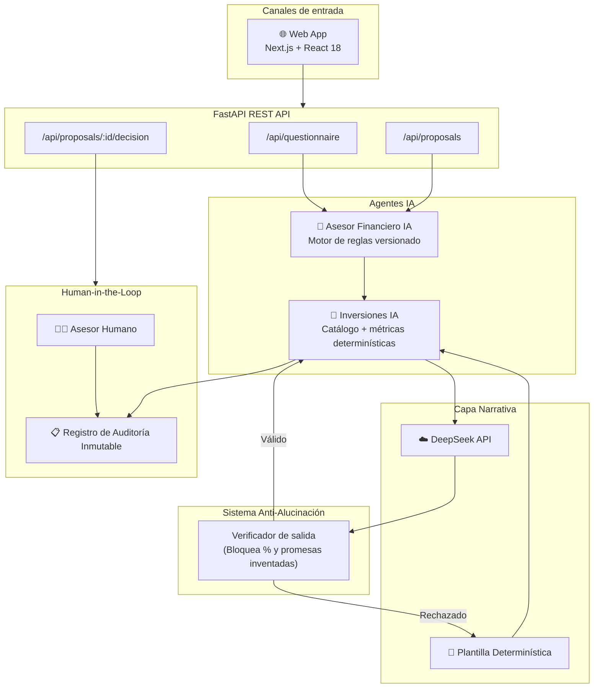

# Auditoría y Funcionamiento del Agente IA (InvertIA)

Este documento explica el funcionamiento técnico de la arquitectura de agentes del proyecto InvertIA, las pruebas automatizadas realizadas y cómo el proyecto cumple con los lineamientos del **Track 3 del Hackathon Agentic Scale (Ecuador Tech Week 2026)**.

---

## 1. Track Asignado

**Track 3: Robo-Advisory y Automatización de Estrategias de Inversión**

El proyecto cumple con los criterios mínimos requeridos:
- **HU 1 (Perfil de inversionista transparente):** El agente realiza un cuestionario, calcula el perfil mediante reglas visibles y versionadas, permitiendo revisar las respuestas.
- **HU 2 (Propuesta explicable de portafolio):** Utiliza un catálogo de instrumentos y muestra métricas de riesgo y asignación, sin ejecutar órdenes.
- **HU 3 (Revisión por asesor autorizado):** Incorpora un flujo de *Human-in-the-Loop* (HITL) que exige que un asesor humano apruebe, edite o rechace la propuesta antes de enviarla. Toda decisión queda auditada.

---

## 2. Diagrama de Arquitectura

El sistema se compone de varios microservicios y canales, orquestados mediante FastAPI en el backend y Next.js en el frontend.

---

## 3. Funcionamiento de los Agentes

InvertIA utiliza una arquitectura **"Deterministic Core + Narrative Layer"**.

### 3.1 Asesor Financiero IA (Motor Determinístico)
- Valida las respuestas del cuestionario y aplica reglas de pesos predefinidas (`profile_rules_v1.json`).
- Calcula un score (0-100) y aplica reglas restrictivas (*Knockouts*), como limitar el riesgo si el cliente tiene un horizonte de inversión muy corto.
- Asegura reproducibilidad matemática completa.

### 3.2 Inversiones IA (Capa Narrativa - *Best Use of DeepSeek*)
- Conecta con **DeepSeek** para traducir los datos duros (retornos, volatilidad, asignación de activos) en una narrativa clara y explicable para el cliente.
- **Protección Anti-Alucinación:** DeepSeek **solo redacta, no calcula**. Las métricas son calculadas por el backend y enviadas en el prompt. Luego de recibir la respuesta de DeepSeek, un verificador comprueba mediante expresiones regulares que la IA no haya inventado porcentajes, tickers de instrumentos, ni prometido retornos futuros.
- Si DeepSeek alucina o la API está caída, el sistema hace un *fallback* a plantillas determinísticas para garantizar la disponibilidad del servicio.

---

## 4. Tipo de Negocio al que Aplica

La solución está diseñada primordialmente para **Cooperativas de Ahorro y Crédito (COAC)**, bancos privados, casas de valores y fintechs de ahorro en Ecuador.
Permite estandarizar y escalar el proceso regulatorio de perfilamiento de riesgo (*suitability assessment*) y la generación de propuestas explicables, manteniendo siempre a un asesor humano como responsable final, cumpliendo así con las normativas locales (SEPS / SBS) e internacionales (MiFID II).

---

## 5. Integración con Sistemas Empresariales Existentes

- **Fase 1 (Microservicio):** Se integra consumiendo una API REST desde el Core Bancario actual para validar la identidad y el saldo del cliente, usando webhooks para notificar al CRM cuando una propuesta requiera validación humana.
- **Fase 2 (Profunda):** Single Sign-On (SSO) con las credenciales del banco, pre-llenando perfiles con historial transaccional, y enlazando la firma electrónica del cliente y del asesor.
- **Fase 3 (Multicanal):** Expansión hacia WhatsApp Business, donde el cliente responde las preguntas directamente desde el chat.

---

## 6. Evidencia de Pruebas Automatizadas

Se ha ejecutado una auditoría técnica completa sobre la confiabilidad del Agente, logrando un **100% de éxito (46 pruebas pasadas)** en el backend (`pytest`).

**Detalle de la validación técnica:**
1. `TestScoringDeterministico`: Verifica que los puntajes se calculan correctamente y bajo reglas versionadas.
2. `TestAntiAlucinacion`: Valida que el agente bloquee respuestas inventadas, vacías o que prometan rentabilidad (mitigación de riesgos).
3. `TestDeepSeek` y `TestDeepSeekCasosBorde`: Verifica la conexión con DeepSeek, simulando timeouts, bloqueos y respuestas correctas.
4. `TestHITLGate`: Confirma que toda propuesta generada queda en estado "pendiente", impidiendo su envío hasta que el asesor la apruebe.
5. `TestDiversificacion`: Prueba las reglas de distribución de activos garantizando que ningún instrumento concentre más del 50%.

El nivel de pruebas cumple ampliamente con el **Nivel Intermedio** descrito en los criterios de evaluación del Hackathon.
